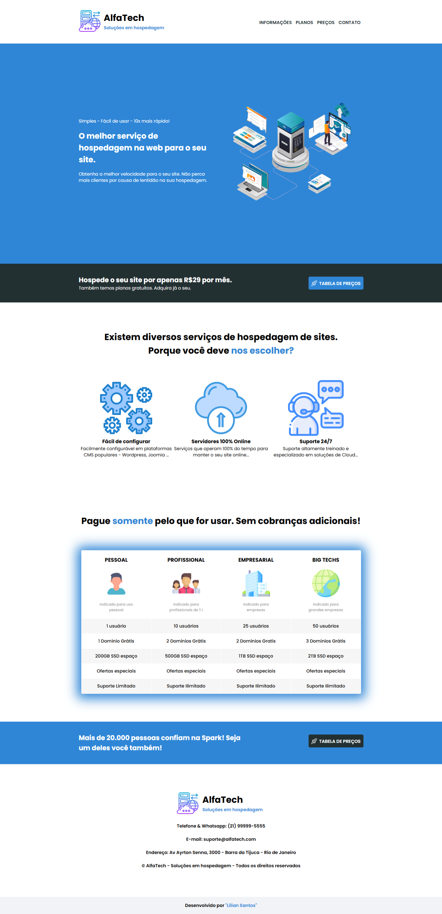
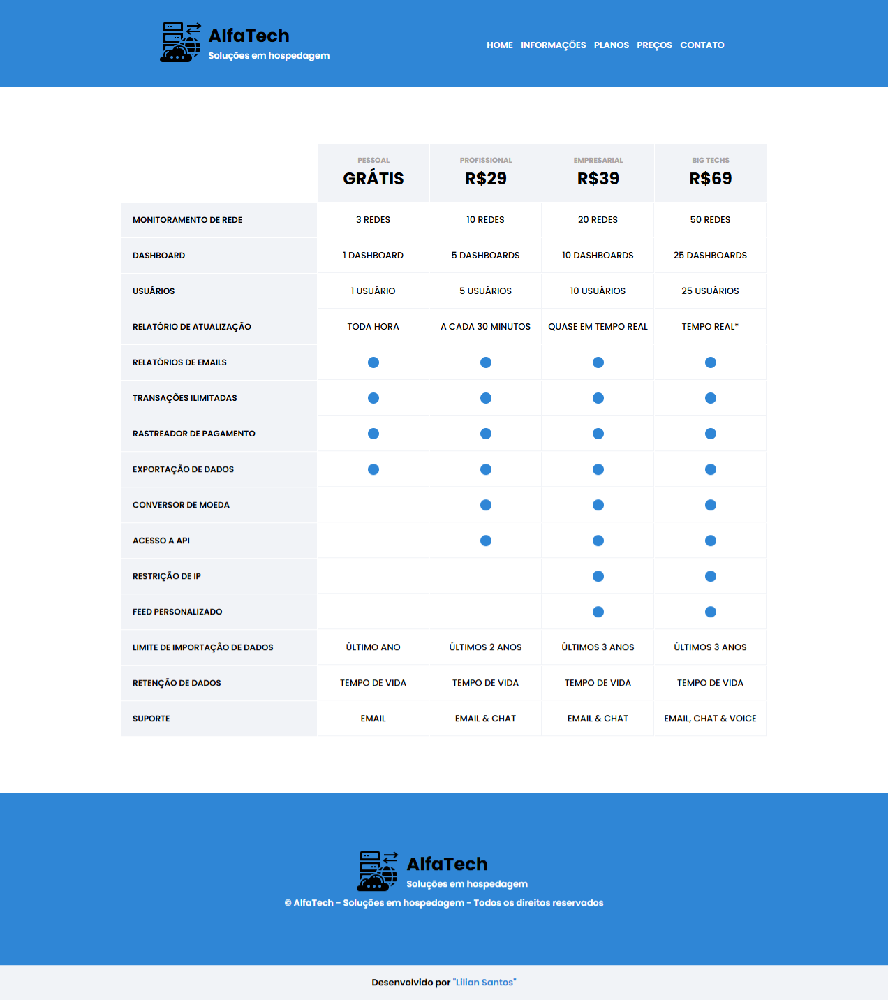

# 🌐 AlfaTech: Soluções em Hospedagem

Projeto desenvolvido como parte do curso da **DevMedia**, com o objetivo de criar páginas modernas e responsivas para uma empresa fictícia de hospedagem de sites: **AlfaTech**.

## 🧩 Sobre o projeto

O **AlfaTech** é um site institucional que apresenta os serviços de hospedagem oferecidos pela empresa, com foco em **design limpo**, **acessibilidade** e **boa usabilidade**.

Durante o desenvolvimento foram criadas **duas páginas principais**:
- 🏠 **Página Inicial** – Apresenta a empresa, seus diferenciais e informações gerais.
- 💰 **Tabela de Preços** – Exibe os planos de hospedagem disponíveis com destaque visual e informações comparativas.

O projeto foi totalmente desenvolvido com **HTML5** e **CSS3**, aplicando boas práticas de estruturação e estilização aprendidas no curso.

---

## 🖥️ Tecnologias utilizadas

- HTML5  
- CSS3  

---

## 📸 Demonstração do projeto

### 🏠 Página Inicial   

### 💰 Página de Tabela de Preços  

